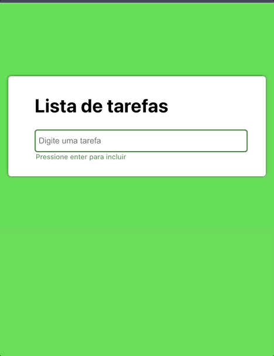

# #NÃODURMACOMESSA - Lista de tarefas

Esse é o código fonte do projeto feito na mentoria #NÃODURMACOMESSA, o código está completo com um `CRUD - Create, Read, Update and Delete` de uma lista de tarefas.

O objetivo foi criar a possibilidade de incluir, concluir e remover uma tarefa.

O resultado final pode ser acessado clicando [aqui](https://todo.franciscpd.dev)



Seguem abaixo comandos utilizados na aula.

## NPM

Aprendemos como inicializar um projeto limpo com o npm:

```npm init```

Ao preencher as informações solicitadas, cria um arquivo `package.json` para o projeto, possibilitando assim a instalação de libs.

```npm install <pkg>```

Faz a instalação de um pacote no npm, onde devemos substituir o `<pkg>` pelo nome do pacote, exemplo `npm install react`.

```npm uninstall <pkg>```

Remove o pacote do projeto.

## Create react app

Aprendemos também sobre o create-react-app que é um projeto que visa nos auxiliar à criação de um novo projeto sem a necessidade de configurações extras.

```npx create-react-app nome-do-app```

Esse comando executa a criação de um novo projeto no diretório corrente, após a criação do projeto devemos acessar a pasta `cd nome-do-app` e rodar o comando `npm start` que irá executar o projeto e abrir o navegador.

Caso não abra automaticamente o navegador, basta acessar o endereço: `http://localhost:3000`